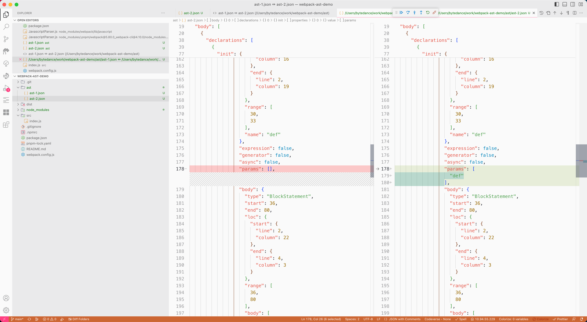

# Getting Started

## Related Issue & MR

- [AST was illegal after webpack process](https://github.com/webpack/webpack/issues/17030)
- [fix: avoid modify ast params object reference](https://github.com/webpack/webpack/pull/17032)

## Demo Description

We say a entry file [src/index.js](./src/index.js), when bundle with webpack, there are two version ast:

- [ast/ast-1.json](./ast/ast-1.json) is a ast snapshot in https://github.com/webpack/webpack/blob/main/lib/javascript/JavascriptParser.js#L3465

- [ast/ast-2.json](./ast/ast-2.json) is a ast snapshot in https://github.com/webpack/webpack/blob/v5.80.0/lib/javascript/JavascriptParser.js#L3475

the ast-1.json is legal, but ast-2.json is illegal(can't not be traversed by acorn-walk and can't not restore to source code)

## diff ast-1.json and ast-2.json

